# Sistem Pakar Diagnosa Penyakit Ikan Nila Menggunakan Metode Certainty Factor

Aplikasi sistem pakar berbasis desktop yang dikembangkan menggunakan **Java NetBeans IDE 8.2** untuk membantu proses diagnosa penyakit pada ikan nila berdasarkan gejala yang dipilih pengguna. Sistem menerapkan metode **Certainty Factor** untuk menghitung tingkat keyakinan terhadap hasil diagnosa berdasarkan nilai bobot dari setiap gejala.

## 🔐 Login Demo

| Username | Password |
|----------|----------|
|   abiyu  | password |

---

# 📸 Tampilan Sistem

### 1. Halaman Register

Halaman pendaftaran akun administrator baru.

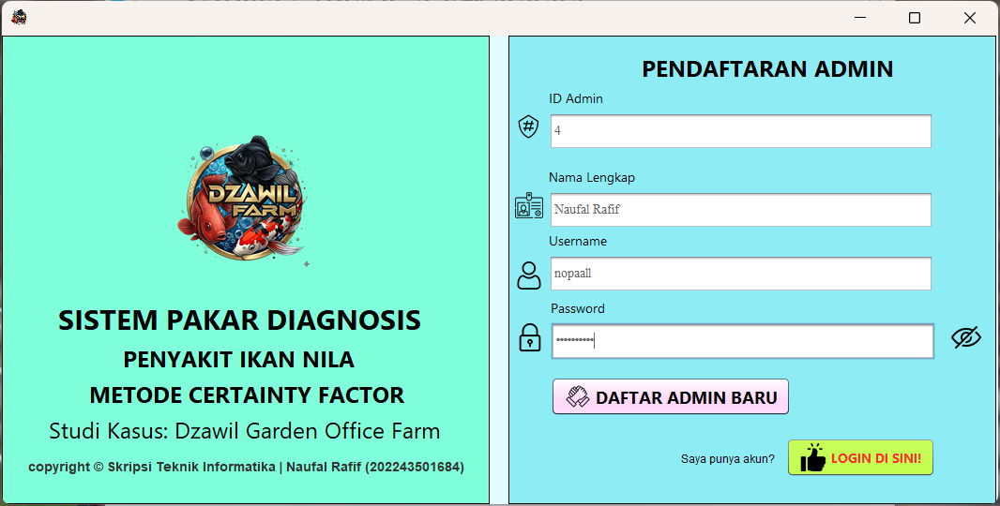

---

### 2. Halaman Login

Halaman autentikasi administrator sebelum mengakses sistem.

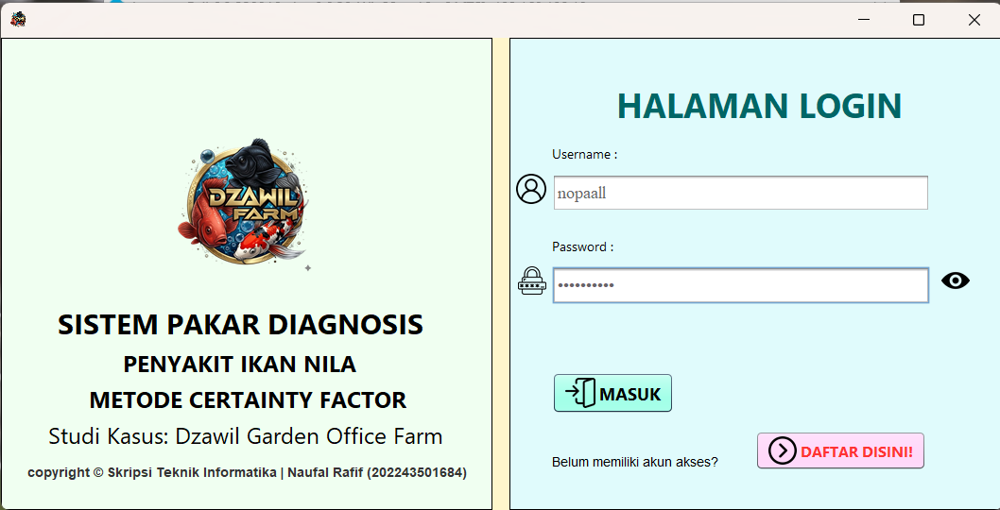

---

### 3. Dashboard

Menampilkan ringkasan informasi dan menu utama sistem.

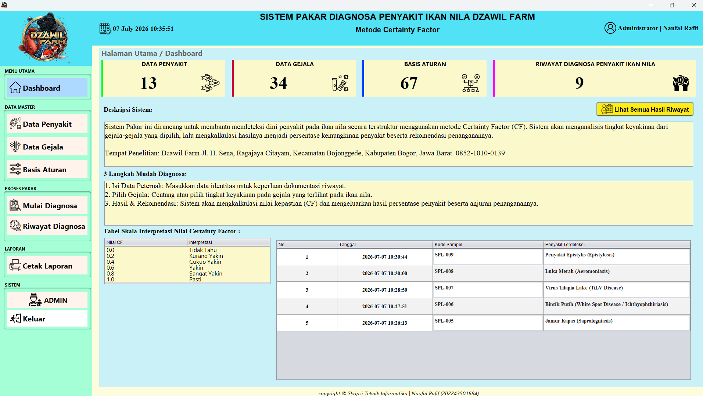

---

### 4. Data Penyakit

Halaman untuk mengelola data penyakit ikan nila.

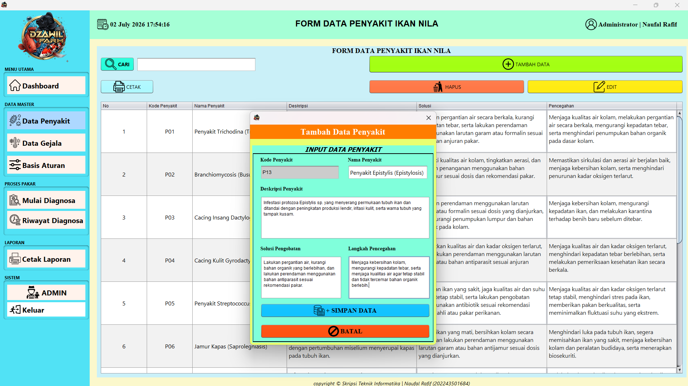

---

### 5. Data Gejala

Halaman untuk mengelola data gejala penyakit ikan nila.

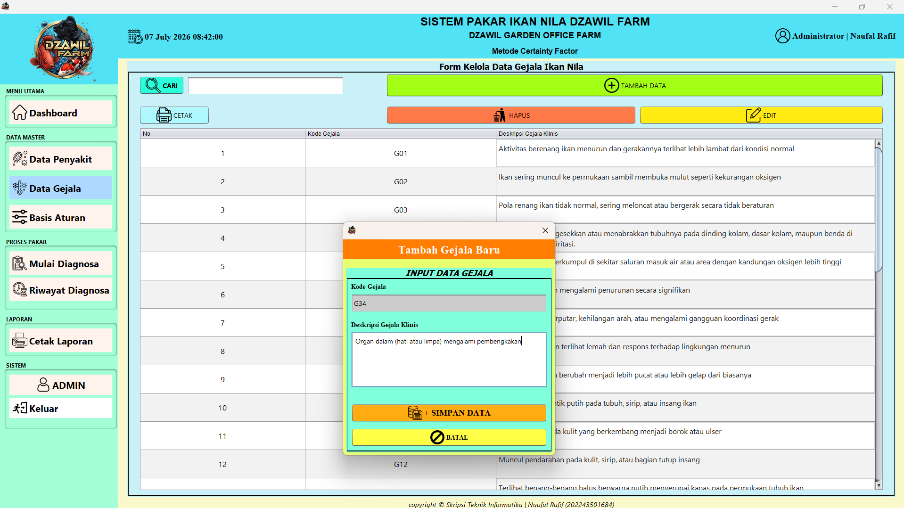

---

### 6. Data Aturan

Halaman untuk mengelola aturan yang menghubungkan gejala dengan penyakit beserta nilai Certainty Factor.

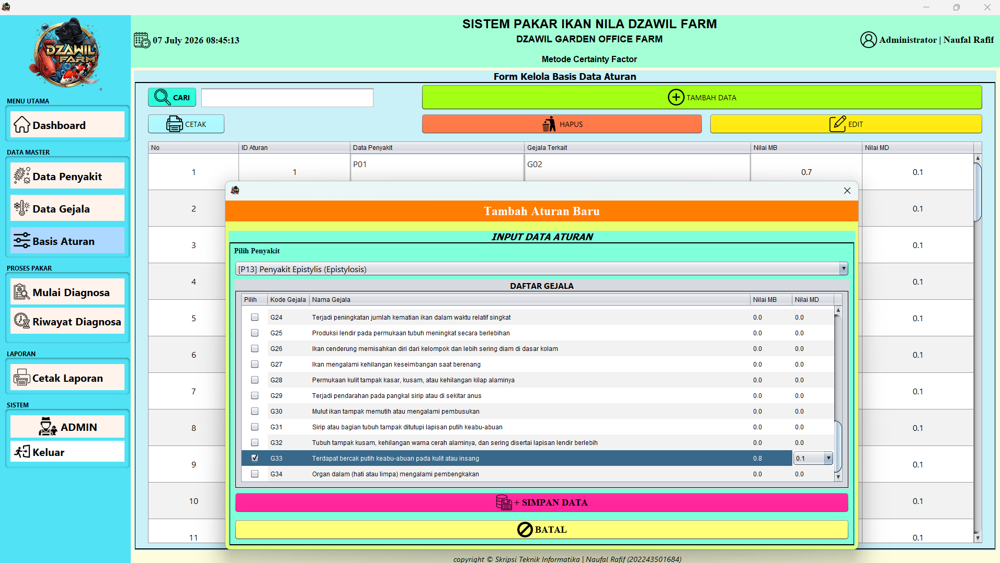

---

### 7. Proses Diagnosa

Halaman untuk memilih gejala dan melakukan proses diagnosa menggunakan metode Certainty Factor.

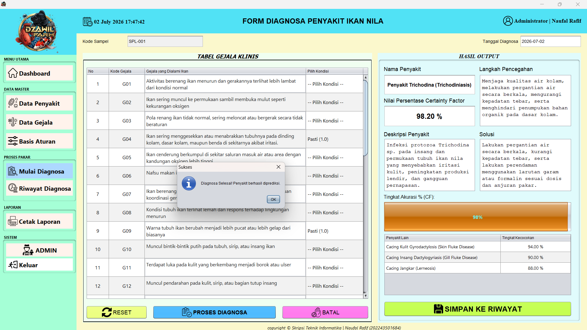

---

### 8. Detail Diagnosa

Menampilkan hasil diagnosa lengkap beserta nilai Certainty Factor dan tingkat keyakinan.

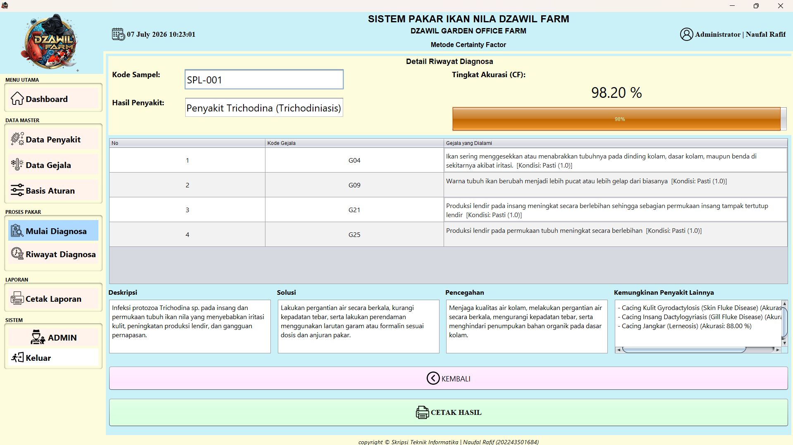

---

### 9. Riwayat Diagnosa

Menampilkan riwayat seluruh hasil diagnosa yang telah dilakukan.

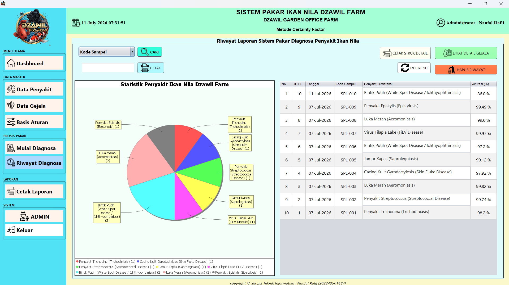

---

### 10. Cetak Data Penyakit

Halaman cetak laporan data penyakit.

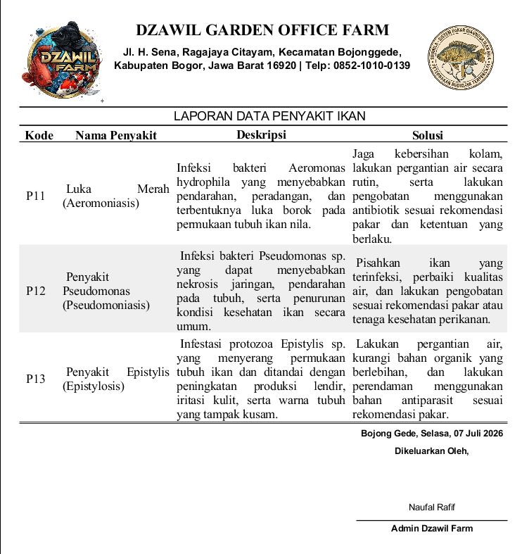

---

### 11. Cetak Data Gejala

Halaman cetak laporan data gejala.

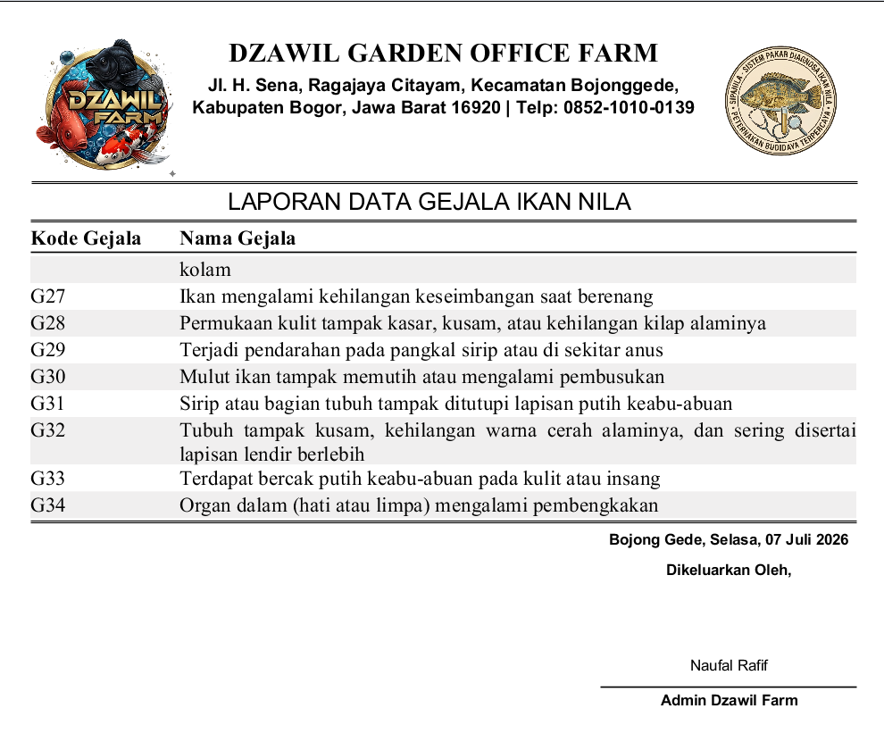

---

### 12. Cetak Data Aturan

Halaman cetak laporan data aturan.

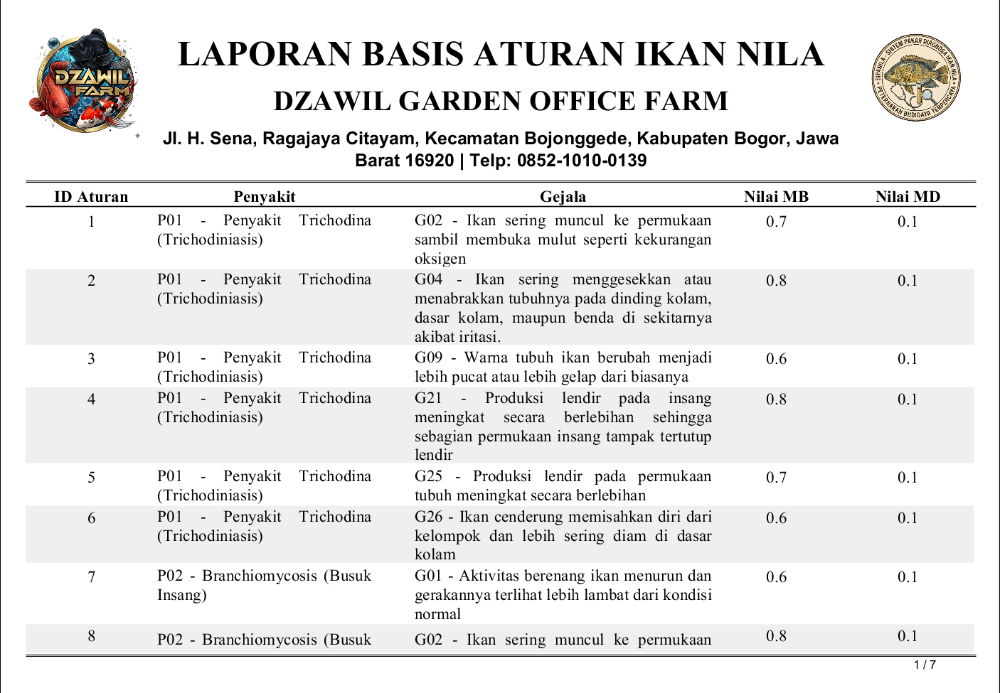

---

### 13. Cetak Hasil Diagnosa

Halaman cetak laporan hasil diagnosa.

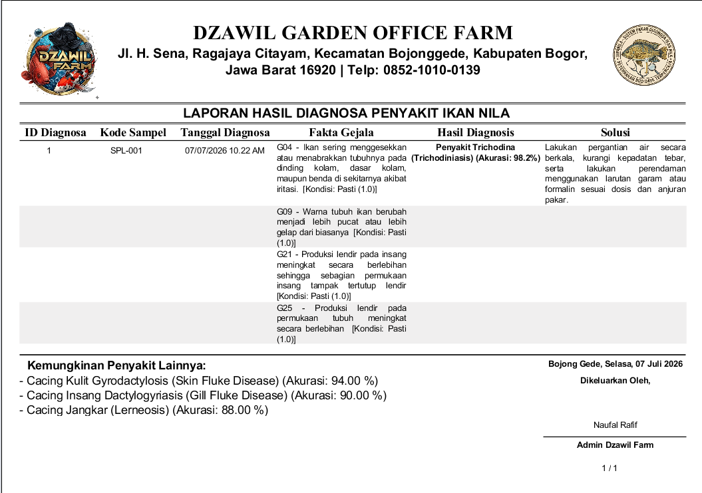

---

### 14. Cetak Riwayat Diagnosa

Halaman cetak laporan riwayat diagnosa.

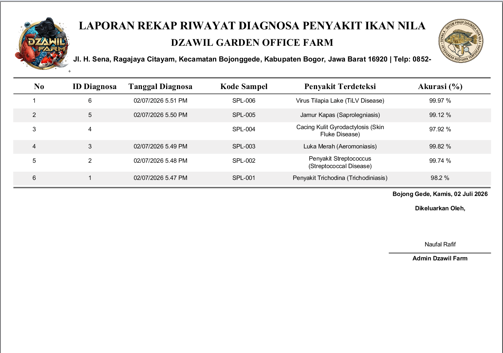

---

### 15. Data Admin

Halaman untuk mengelola akun administrator.

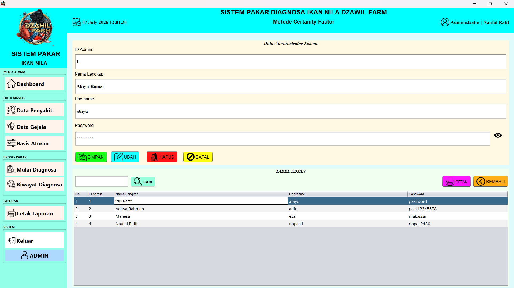

---

### 16. Cetak Data Admin

Halaman cetak laporan data administrator.

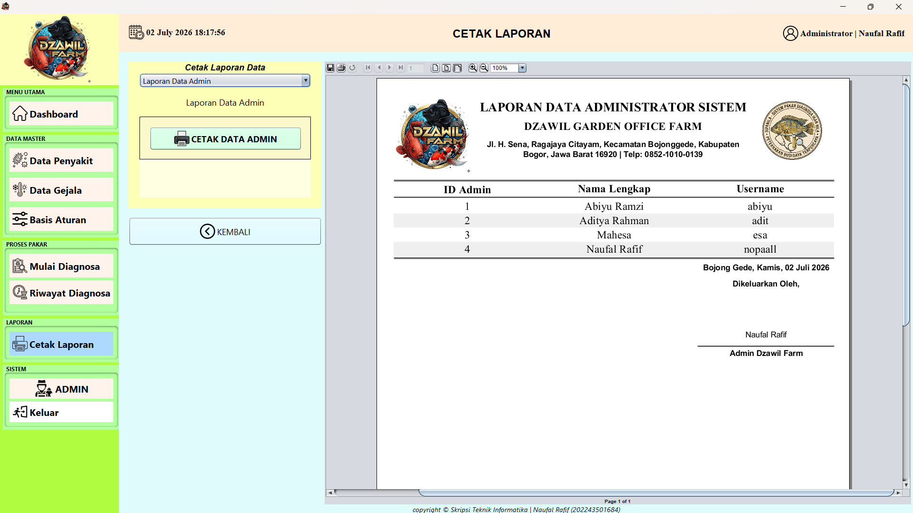

---
